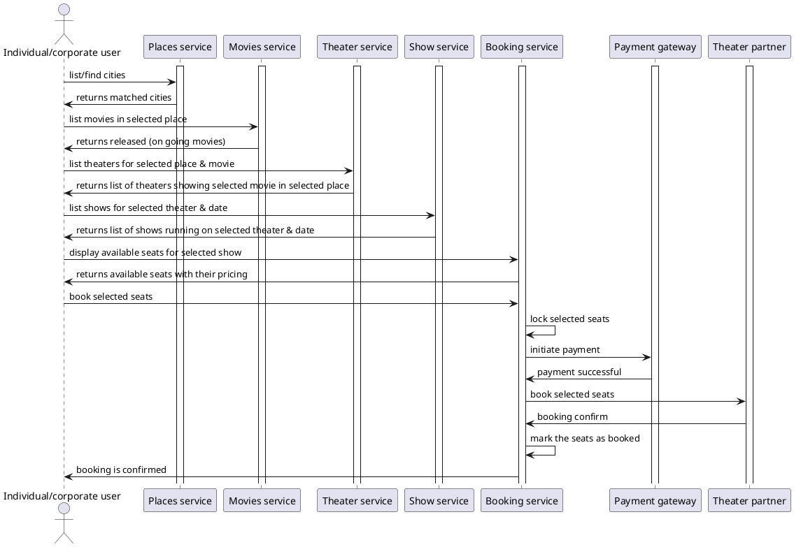

# Sequence flow for booking use case

_Note: Above diagram show direct user interact with backend services but actually user will interact with browser/mobile
application_

Solution to handle transactions for booking:

1. Lock selected seats in our platform so that other user from our platform can not take same seats for same show.
   * Lock has to be timed based. Within given time frame user has to complete payment and confirm booking with theater
     partner,
     otherwise lock will be released and user will not able to complete the booking & payment will be result in refund
     if it was successful at payment gateway.
2. Initiate booking with theater partner (if they have mechanism) / Buy from/reserve some seats at theater partner
    * Initiate booking at theater partner so that other aggregator can not book same seat(s) if their system supports
      it.
    * Or buy / reserve some seat(s) from theater partners so that other aggregators can not book same seat(s)
3. Initiate payment at payment gateway
4. Receive/confirm payment from payment gateway
    * if payment is not failed, release the locks and cancel initiation at theater partner.
    * if payment is not confirmed with in given time period, release the locks and cancel initiation at theater partner.
5. Confirm booking with theater partner.
    * If payment is received and booking can not be confirmed, raise refund for the booking and ask user to retry it.
6. Send notifications to user for confirmed booking.

To handle locks for seat(s), we have to use database which allows ACID transactions. 
To reduce read/write race conditions we can cache (who allow Atomic operations) locked + booked seat(s) for the upcoming shows (which are not yet started).
To reduce size of the cache, we can evict entries once the show is started.
