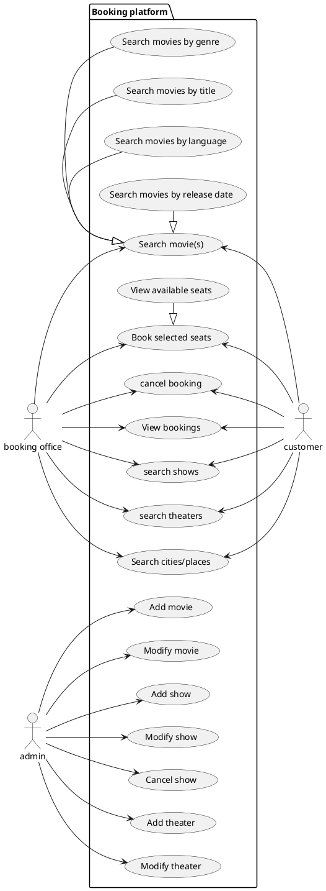

# Use cases

```plantuml
@startuml
left to right direction
actor customer as cust
actor "booking office" as boo
actor admin

package "Booking platform" {
    usecase uc1 as "Search cities/places"
    usecase uc2 as "Search movie(s)"
    usecase uc2a as "Search movies by genre"
    usecase uc2b as "Search movies by title"
    usecase uc2c as "Search movies by language"
    usecase uc2d as "Search movies by release date"
    
    usecase uc3 as "search theaters"
    usecase uc4 as "search shows"
    usecase uc5 as "Book selected seats"
    usecase uc5a as "View available seats"
    usecase uc6 as "View bookings"
    usecase uc7 as "cancel booking"
    
    uc2 <|- uc2a
    uc2 <|- uc2b
    uc2 <|- uc2c
    uc2 <|- uc2d
    uc5 <|- uc5a
    
    cust -up-> uc1
    cust -up-> uc2
    cust -up-> uc3
    cust -up-> uc4
    cust -up-> uc5
    cust -up-> uc6
    cust -up-> uc7
    boo -down-> uc1
    boo -down-> uc2
    boo -down-> uc3
    boo -down-> uc4
    boo -down-> uc5
    boo -down-> uc6
    boo -down-> uc7
    
    usecase uc8 as "Add movie"
    usecase uc9 as "Modify movie"
    usecase uc10 as "Add show"
    usecase uc11 as "Modify show"
    usecase uc12 as "Cancel show"
    usecase uc13 as "Add theater"
    usecase uc14 as "Modify theater"
    
    admin -down-> uc8
    admin -down-> uc9
    admin -down-> uc10
    admin -down-> uc11
    admin -down-> uc12
    admin -down-> uc13
    admin -down-> uc14
}

@enduml
```
